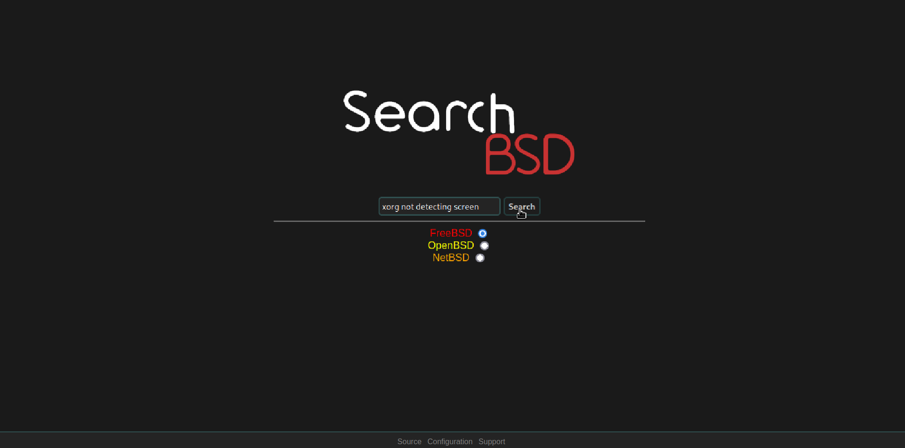

SearchBSD:
Search Engine to make troubleshooting issues on various BSDs easier.
=======
~~SearchBSD uses a list of known forum/wiki/documentation websites categorized for each BSD OS and gives results from these websites to make troubleshooting easier.~~ Due to the massive amount of webpages being processed and the fact we want to grow our OS support, we have moved from lists to collecting websites from other search engines.

